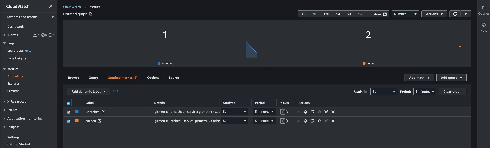
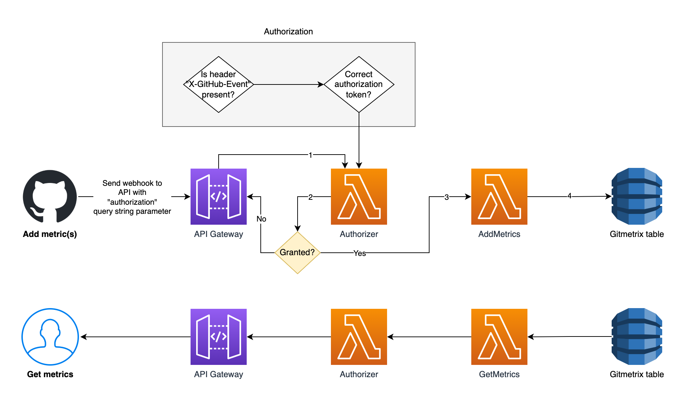
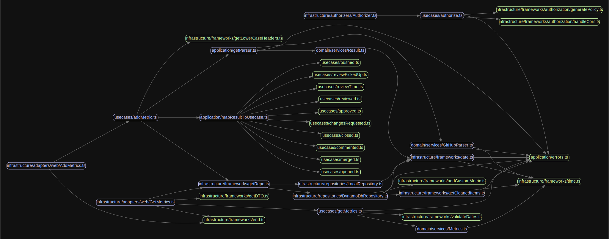

# Gitmetrix 🚀 🧑‍🚀 🧑🏿‍🚀 🧑🏻‍🚀 👩‍🚀 📈

 [](https://sonarcloud.io/summary/new_code?id=mikaelvesavuori_gitmetrix) [](https://codescene.io/projects/33250) [](https://codescene.io/projects/33250) [](https://codecov.io/gh/mikaelvesavuori/gitmetrix) [](https://codeclimate.com/github/mikaelvesavuori/gitmetrix/maintainability)

## Helps you find your team-level engineering metrics from GitHub.

---

With Gitmetrix you get the possibility to extract a set of core Git metrics ("engineering metrics") for a given repository and time span. An example with completely made-up data might look like this:

```json
{
  "repo": "SOMEORG/SOMEREPO",
  "period": {
    "from": "20221005",
    "to": "20221006",
    "offset": 0
  },
  "total": {
    "additions": 74,
    "approved": 136,
    "changedFiles": 187,
    "changesRequested": 158,
    "closed": 146,
    "comments": 100,
    "deletions": 76,
    "merged": 105,
    "opened": 27,
    "pickupTime": "01:04:57:46",
    "pushed": 55,
    "reviewTime": "00:16:05:56"
  },
  "average": {
    "additions": 37,
    "approved": 68,
    "changedFiles": 94,
    "changesRequested": 79,
    "closed": 73,
    "comments": 50,
    "deletions": 38,
    "merged": 53,
    "opened": 14,
    "pickupTime": "00:14:28:53",
    "pushed": 28,
    "reviewTime": "00:08:02:58"
  },
  "daily": {
    "20221005": {
      "additions": 35,
      "approved": 65,
      "changedFiles": 97,
      "changesRequested": 73,
      "closed": 86,
      "comments": 61,
      "deletions": 12,
      "merged": 66,
      "opened": 18,
      "pickupTime": "00:22:30:38",
      "pushed": 3,
      "reviewTime": "00:03:30:59"
    },
    "20221006": {
      "additions": 39,
      "approved": 71,
      "changedFiles": 90,
      "changesRequested": 85,
      "closed": 60,
      "comments": 39,
      "deletions": 64,
      "merged": 39,
      "opened": 9,
      "pickupTime": "00:06:27:08",
      "pushed": 52,
      "reviewTime": "00:12:34:57"
    }
  }
}
```

Or in plain English, for each day (or over a given period), you can now answer questions like:

- How many times is code pushed?
- How many pull requests are opened?
- How many pull requests are closed?
- How many pull requests are merged?
- How many code reviews are approved?
- How many code reviews are closed?
- How many code review comments are made?

It also helps you get some more interesting metrics:

- **Review size**: How many additions/deletions/files changed are there in a pull request that is "ready for review"?
- **Pick-up time**: How long does it take to start doing a code review, from "ready for review" to "review submitted"?
- **Review time**: How long does a code review take, from a review being completed to the commit being merged/closed?

And it's all quite simple: Just deploy Gitmetrix and pass your repository's GitHub webhooks to it!

## How Gitmetrix works

Like [dorametrix](https://github.com/mikaelvesavuori/dorametrix), Gitmetrix is a serverless web service that collects and represents specific delivery-related webhook events sent to it, which are then stored in a database. As a user, you can request these metrics which are calculated from those same stored events.

**Because all metrics are stored beginning on the date at which you start sending webhook events to Gitmetrix you will not be able to retrieve statistics from any time before that.**

Gitmetrix **currently integrates only through GitHub via webhooks and is adapted (out-of-the-box) for an AWS environment**. See the [Support](#support) section for more details — it's not impossible getting it to work in other clouds or Git providers!

## Need even more metrics?

**Looking for DORA metrics?** Then consider [dorametrix](https://github.com/mikaelvesavuori/dorametrix).

**Looking for Individual Contributor metrics from GitHub?** Then consider [this simple Gist](https://gist.github.com/mikaelvesavuori/a0b75f0ebc617e20caab42a2b25c66f3) as a basis.

---

## Prerequisites

- Recent [Node.js](https://nodejs.org/en/) (ideally 18+) installed.
- Amazon Web Services (AWS) account with sufficient permissions so that you can deploy infrastructure. A naive but simple policy would be full rights for CloudWatch, Lambda, API Gateway, DynamoDB, and S3.
- Ideally, some experience with [Serverless Framework](https://www.serverless.com) as that's what we will use to deploy the service and infrastructure.
- You will need to deploy the stack before working with it locally as it uses actual infrastructure even in local mode.

## Installation

Clone, fork, or download the repo as you normally would. Run `npm install`.

## Commands

The below commands are the most critical ones. See `package.json` for more commands! Substitute `npm` for `yarn` or whatever floats your boat.

- `npm start`: Run Serverless Framework in offline mode
- `npm test`: Run tests on the codebase
- `npm run deploy`: Deploy with Serverless Framework
- `npm run build`: Package and build the code with Serverless Framework
- `npm run teardown`: Removes the deployed stack

## Configuration

### Application settings

#### Required

- `custom.config.awsAccountNumber`: Your AWS account number.
- `custom.config.apiKey`: The "API key" or authorization token you want to use to secure your service.

Note that all unit tests use a separate authorization token that you don't have to care about in regular use.

#### Optional

- `custom.config.maxDateRange`: This defaults to `30` but can be changed.
- `custom.config.maxLifeInDays`: This defaults to `90` but can be changed.
- `custom.config.tableName`: This defaults to `gitmetrix` but can be changed.

#### Environment variables

- `REGION`: The AWS region you want to use. Takes the value from `provider.region`.
- `TABLE_NAME`: The DynamoDB table name you want to use. Takes the value from `custom.config.tableName`.
- `API_KEY`: Only available in the authorizer function. Takes the value from `custom.config.apiKey`.

## Running locally

Run `npm start`.

Note that it will attempt to connect to a database, so deploy the application and infrastructure before any local development.

## Testing

Run `npm run test` to run all unit tests.

### Create test data

If you want a bit of test data to toy around with, run `npm run test:createdata`. You can modify the settings of the test data creation by modifying the constants in `tests/createTestData.ts`. This is especially important if you have changed the region of the deployment or the name of the table.

**Note that all primary keys for test data are generated with `SOMEORG/SOMEREPO` as the repository name.**

## Deployment

First make sure that you have a fallback value for your AWS account number in `serverless.yml`, for example: `awsAccountNumber: ${opt:awsAccountNumber, '123412341234'}` or that you set the deployment script to use the flag, for example `npx sls deploy --awsAccountNumber 123412341234`.

Then you can deploy with `npm run deploy`.

## Logging and metrics

Gitmetrix uses [mikrolog](https://github.com/mikaelvesavuori/mikrolog) and [mikrometric](https://github.com/mikaelvesavuori/mikrometric) for logging and metrics respectively.

Logs will have a richly structured format and metrics for cached and uncached reads will be output to CloudWatch Logs (using Embedded Metrics Format, under the covers). See the below image for a basic example of how you can see the number of uncached vs cached reads in CloudWatch.



## Creating the GitHub webhook

Create a webhook in your repository's `Settings` page. Under the `Code and automation` pane, you should see `Webhooks`. _[See this guide if you need more exact instructions](https://docs.github.com/en/developers/webhooks-and-events/webhooks/creating-webhooks)_.

For `Payload URL`—assuming you are using the default API endpoint—add your endpoint and auth token in the general format of

```
https://RANDOM.execute-api.REGION.amazonaws.com/STAGE/metrics?authorization=API_KEY
```

Next, set the content type to `application/json`, skip secrets, make sure SSL is enabled, and select the following event types to trigger the webhook:

- `Issue comments`
- `Pull requests`
- `Pull request reviews`
- `Pushes`

_Note that not all of the individual fine-grained events are actually used, but the above four represent the four overall categories or types we need_.

### Note on security

Normally, if possible, you should use [GitHub webhook secrets](https://docs.github.com/en/developers/webhooks-and-events/webhooks/securing-your-webhooks). These need to be verified against a hash constructed based on the request body and a secret. The "secret" is provided by you so this is easy enough to do, but in AWS the Lambda Authorizer will not have access to the request body. This makes it practically unfeasible to implement webhook secrets — for AWS, at least in this way.

The approach used in Gitmetrix is instead to make the best of the situation and require an `authorization` query string parameter with a custom authorization token. This then gets verified by a [Lambda Authorizer function](https://docs.aws.amazon.com/apigateway/latest/developerguide/apigateway-use-lambda-authorizer.html).

All GET requests require that same token but in a more practical `Authorization` header.

This approach adds a minimal security measure but is flexible enough to also work effortlessly with any integration tests you might want to run. At the end of the day an acceptable compromise solution, I hope.

## Using the service

_Remember to pass your authorization token in the `Authorization` header!_

### Example request: From date YYYYMMDD to date YYYYMMDD

Get metrics for a specific interval:

```bash
GET {BASE_URL}/metrics?repo=SOMEORG/SOMEREPO&from=20221228&to=20221229
```

| Parameter | Required | Format     | Example                     |  Description                                                   |
| --------- | -------- | ---------- | --------------------------- | -------------------------------------------------------------- |
| `repo`    | Yes      | `ORG/REPO` | `mikaelvesavuori/gitmetrix` | Name of repository to get metrics for                          |
| `from`    | Yes      | `YYYYMMDD` | `20221020`                  | Set a specific date to start from                              |
| `to`      | Yes      | `YYYYMMDD` | `20221020`                  | Set a specific date to end with (defaults to yesterday's date) |

### Example request: Last X days

Get metrics for a specific sliding window of time:

```bash
GET {BASE_URL}/metrics?repo=SOMEORG/SOMEREPO&last=30
```

| Parameter | Required | Format     | Example                     |  Description                               |
| --------- | -------- | ---------- | --------------------------- | ------------------------------------------ |
| `repo`    | Yes      | `ORG/REPO` | `mikaelvesavuori/gitmetrix` | Name of repository to get metrics for      |
| `last`    | Yes      | Number     | `30`                        | Set a number of days to use in query range |

**Note that the last and from/to patterns are mutually exclusive!**

### Offset for time zone differences

You can optionally offset the query to adapt to your own time zone, for example:

```bash
GET {BASE_URL}/metrics?repo=SOMEORG/SOMEREPO&last=30&offset=-4
```

| Parameter | Required | Format                        | Example |  Description                                                  |
| --------- | -------- | ----------------------------- | ------- | ------------------------------------------------------------- |
| `offset`  | No       | Number between `-12` and `12` | `30`    | Set an offset in hours to adapt query to time zone difference |

### Example response

```ts
{
  // Dynamically set by the response
  "repo": "SOMEORG/SOMEREPO",
  "period": {
    "from": "20221005",
    "to": "20221006",
    "offset": 0
  },
  // Aggregated results for the period
  "total": {
    "additions": 74,
    "approved": 136,
    "changedFiles": 187,
    "changesRequested": 158,
    "closed": 146,
    "comments": 100,
    "deletions": 76,
    "merged": 105,
    "opened": 27,
    "pickupTime": "01:04:57:46",
    "pushed": 55,
    "reviewTime": "00:16:05:56"
  },
  "average": {
    "additions": 37,
    "approved": 68,
    "changedFiles": 94,
    "changesRequested": 79,
    "closed": 73,
    "comments": 50,
    "deletions": 38,
    "merged": 53,
    "opened": 14,
    "pickupTime": "00:14:28:53",
    "pushed": 28,
    "reviewTime": "00:08:02:58"
  },
  // For each day...
  "daily": {
    "20221005": {
      "additions": 35,
      "approved": 65,
      "changedFiles": 97,
      "changesRequested": 73,
      "closed": 86,
      "comments": 61,
      "deletions": 12,
      "merged": 66,
      "opened": 18,
      "pickupTime": "00:22:30:38",
      "pushed": 3,
      "reviewTime": "00:03:30:59"
    },
    "20221006": {
      "additions": 39,
      "approved": 71,
      "changedFiles": 90,
      "changesRequested": 85,
      "closed": 60,
      "comments": 39,
      "deletions": 64,
      "merged": 39,
      "opened": 9,
      "pickupTime": "00:06:27:08",
      "pushed": 52,
      "reviewTime": "00:12:34:57"
    }
  }
}
```

---

## Details on the technical implementation

### Anonymous data

Gitmetrix does not collect, store, or process any details on a given individual and their work. All data is strictly anonymous and aggregated. You should feel entirely confident that nothing invasive is happening with the data handled with Gitmetrix.

### Data is removed after a period of time

To keep the volume of data manageable, version `2.1.0` introduces a `maxLifeInDays` setting. It defaults to `90` days, after which DynamoDB will remove the record after the given period + 1 day. You can set the value to any other value, as needed.

### What about the authorization token in the query string parameter?

This is a totally normal and acceptable way of passing the value. However, the value could potentially be logged by intermediary layers. Gitmetrix does nothing with the value and it's unlikely that there is anything in the AWS infrastructure-as-code that logs the value either.

### Metrics and history

**The most recent date you can get metrics for is the day prior, i.e. "yesterday"**. The reason for this is partly because it makes no real sense to get incomplete datasets, as well as because Gitmetrix caches all data requests. Caching a dataset with incomplete data would not be very good.

### Time

#### Time zone used

Gitmetrix uses UTC/GMT+0/Zulu time.

#### How timestamps are set

Timestamps are set internally in Gitmetrix and generated based on the UTC/GMT+0/Zulu time.

To cater for more precise queries, you can use the `offset` parameter with values between `-12` and `12` (default is `0`) to adjust for a particular time zone.

### Database design

| Primary Key          | Secondary Key      | Attribute names |
| -------------------- | ------------------ | --------------- |
| `METRICS_{ORG/REPO}` | `{Unix timestamp}` | See below       |

Attribute names are shortened and may look a bit mysterious, but it's really just about optimizing them to the smallest values so that they don't eat unnecessary bandwidth, especially if you are fetching longer periods.

The below outlines all of the attributes on a given day such as `20221020`:

| Attribute | Type    |  Description           |
| --------- | ------- | ---------------------- |
|  `pk`     | String  | Primary key (system)   |
|  `sk`     | String  | Sort key (system)      |
|  `p`      | Number  | Pushed                 |
|  `o`      | Number  | Opened                 |
|  `m`      | Number  | Merged                 |
|  `cl`     | Number  | Closed                 |
|  `cm`     | Number  | Commented              |
|  `ap`     | Number  | Approved               |
|  `chr`    | Number  | Changes requested      |
|  `ad`     | Number  | Additions              |
|  `chf`    | Number  | Changed files          |
|  `d`      | Number  | Deletions              |
|  `pt`     | Number  | Pickup time in seconds |
|  `rt`     | Number  | Review time in seconds |

Metrics are [incremented atomically](https://docs.aws.amazon.com/amazondynamodb/latest/developerguide/WorkingWithItems.html#WorkingWithItems.AtomicCounters).

### Caching

On any given metrics retrieval request, Gitmetrix will behave in one of two ways:

- **Cached filled**: Return the cached content.
- **Cache empty**: Query > Store response in cache > Return response.

Caching is always done for a range of dates. All subsequent lookups will use the cached data only if the exact same "from" and "to" date ranges are cached.

| Primary Key                 | Secondary Key           | Value (example)           |
| --------------------------- | ----------------------- | ------------------------- |
| `METRICS_CACHED_{ORG/REPO}` | `{FROM_DATE}_{TO_DATE}` | `Items` array of response |

## How the metrics are calculated

The majority of metrics are very simple additions to numeric counts. Beyond these basic ones, there are also a few that need to do a bit more, ending up with 2 or more calculations for a single change.

The basic ones are:

| Add +1 to | When                      |
| --------- | ------------------------- |
|  `p`      | Code is pushed            |
|  `m`      | Code is merged            |
|  `o`      | GitHub Issue is opened    |
|  `cl`     | GitHub Issue is closed    |
|  `cm`     | GitHub Issue gets comment |

The somewhat more complicated ones are detailed below.

### Review size (PR size)

_Known when a PR review is opened/requested_.

Measures the number of concrete file-level changes in files for a given PR review.

#### Matches:

| Webhook        | Action             | PR State |
| -------------- | ------------------ | -------- |
| `pull_request` | `ready_for_review` | `open`   |

#### Affects:

| Attribute | Description   |
| --------- | ------------- |
|  `ad`     | Additions     |
|  `chf`    | Changed files |
|  `d`      | Deletions     |

Adds the numeric values from `body.pull_request.additions`, `body.pull_request.deletions`, and `body.pull_request.changed_files` to their current daily values.

### Pick-up time

_Known when a review is approved or changes are requested_.

Measures the time from opening a PR to submitting the first PR review (i.e. approving or requesting changes).

#### When a change is approved - Matches:

| Webhook               | Action      | Review State |
| --------------------- | ----------- | ------------ |
| `pull_request_review` | `submitted` | `approved`   |

#### When a change is approved - Affects:

| Attribute | Description                     |
| --------- | ------------------------------- |
|  `pt`     | Pickup time                     |
|  `ap`     | Pull request review is approved |

#### When changes are requested - Matches:

| Webhook               | Action      | Review State        |
| --------------------- | ----------- | ------------------- |
| `pull_request_review` | `submitted` | `changes_requested` |

#### When changes are requested - Affects:

| Attribute | Description                                  |
| --------- | -------------------------------------------- |
|  `pt`     | Pickup time                                  |
|  `chr`    | Pull request review gets "Changes requested" |

Compares the diff between `body.pull_request.created_at` and `body.review.submitted_at` and adds this difference in seconds to the current value of `PICKUP_TIME_{ORG/REPO}`.

### Review time

_Known when a PR is closed and we have some merge and comment activity to measure._

Measures the time from the initial PR code review to when the PR is merged. While technically we don't need PR comments, without them effectively we can't infer a review even took place. This is imperfect but better than not having such a safeguard.

#### Matches:

| Webhook        | Action   | PR State | Conditions                                                                                  |
| -------------- | -------- | -------- | ------------------------------------------------------------------------------------------- |
| `pull_request` | `closed` | `closed` | `body.pull_request.merged_at` is not empty, i.e. it's not just closed, it's actually merged |
|                |          |          | `body.pull_request.review_comments` is more than zero                                       |

#### Affects:

| Attribute | Description             |
| --------- | ----------------------- |
|  `rt`     | Review time             |
|  `m`      | Merged (only if merged) |
|  `c`      | Closed                  |

Compares the diff between `body.pull_request.created_at` and `body.pull_request.merged_at`.

---

## Diagrams

### Solution diagram

_As it stands currently, Gitmetrix is implemented in an AWS-oriented manner. This should be fairly easy to modify so it works with other cloud platforms and with other persistence technologies. If there is sufficient demand, I might add extended support. Or you do it! Just make a PR and I'll see how we can proceed._



### Code flow diagram

The below diagram is generated by [Madge](https://github.com/pahen/madge).



Please see the [generated documentation site](https://gitmetrix.pages.dev) for more detailed information.

---

## Support

### What about more Git integrations?

Gitmetrix **currently integrates only through GitHub via webhooks**. The internal logic however allows for extending with any number of "parsers" that are specific to any version control software (VCS) such as Bitbucket or Azure DevOps. Ideally, to function similarly, the VCS should support webhooks so the experience is equivalent to the current state of Gitmetrix.

_Consider making a pull request, starting an Issue, or otherwise informing of your interest in this, if it's important to you or if you have ideas for resolving this in a good way._

### What about using a non-AWS stack?

That's absolutely doable!

The code is already prepared to be extensible for other databases (repositories) and other compute solutions than AWS Lambda. You could relatively easily make the changes by adding a repository to handle the concrete implementation details of your chosen database and adding some other variant of the wrapping handler functions, while still being able to use all the same internal logic. Except for these bigger details, there might be smaller stuff we need to take care of to make Gitmetrix truly support more platforms—but none of this is a real blocker.

_Consider making a pull request, starting an Issue, or otherwise informing of your interest in this, if it's important to you or if you have ideas for resolving this in a good way._

---

## Ideas for improvements

- "Direct parser", for direct API calls rather than using webhooks?
- "Coding time metric", measuring the time between an initial commit and when a PR is ready to review?
- Integration and system tests?
- Cache with offset - currently caches on date range/timestamp range, but the query will be incorrect if using other (subsequent) offset

---

## References

- [GitHub: Webhook events and payloads](https://docs.github.com/en/developers/webhooks-and-events/webhooks/webhook-events-and-payloads)
